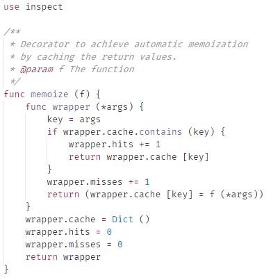

# Iodine for VS Code

Iodine language support for Visual Studio Code.

## Features

Supported:
- Syntax highlighting
- Symbol auto-closing
- Toggle comments ( `Ctrl+/` )

Planned:
- Snippets
- Intellisense
- Document reformatting
- Refactoring (renaming, etc.)

## Requirements

Visual Studio Code 1.16.0 or newer.

## Release Notes

Users appreciate release notes as you update your extension.

### 0.0.1

Initial release with working syntax highlighting and basic functionality.